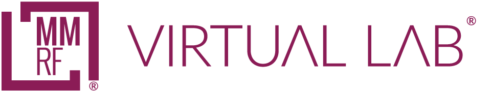

# MMRF Virtual Lab

Welcome to the **MMRF Virtual Lab**, a secure, cloud-based data platform developed by the **Multiple Myeloma Research Foundation (MMRF)** to accelerate discovery through data sharing and collaboration.  
Virtual Lab integrates clinical, genomic, and multi-omics data from MMRF programs into one powerful environment, enabling researchers to explore, analyze, and visualize data seamlessly.

---

## About the Platform

The MMRF Virtual Lab is built on the **Gen3** open-source framework, providing the foundation for secure data management, controlled access, and scalable analysis.  
The platform empowers scientists and clinicians to work with harmonized datasets without needing complex infrastructure, fostering collaboration and reproducibility across the myeloma research community.

---

## What You Can Do in Virtual Lab

- **Explore and Cohort** - interactively search and filter participants based on clinical and molecular variables.  
- **Visualize Data** - generate plots and charts to identify trends and insights within datasets.  
- **Access and Download Data** - view and request access to harmonized multi-omics data, including WES, WGS, and RNA-seq.
<!-- - **Integrate Analyses** — combine data across studies and modalities for deeper biological insight.  
- **Contribute and Share** — approved collaborators can upload processed data or metadata to expand the shared resource. -->

---

## Datasets Available

The Virtual Lab currently hosts data from key MMRF initiatives:

- **CoMMpass Study** - longitudinal genomic and clinical data from newly diagnosed multiple myeloma patients.  
- **Immune Atlas** - high-dimensional immune profiling and single-cell data.  

New datasets and tools are continually added as part of MMRF’s mission to drive advances in multiple myeloma.

---

## Getting Started

- Visit the [About page](gen3-resources/about.md) to learn how the Virtual Lab was built and the technology behind it.  
- Read the [User Guide](gen3-resources/user-guide/index.md) for detailed instructions on navigating the platform, searching data, and using analysis tools.  
- For account access or collaboration opportunities, contact the MMRF Translational Research Team at **[vlab@themmrf.org](mailto:vlab@themmrf.org)**.

---

### Powered by Gen3

The MMRF Virtual Lab leverages the **Gen3 data platform**, developed by the [Center for Translational Data Science (CTDS)](https://ctds.uchicago.edu/) at the University of Chicago.  

This partnership ensures the platform remains secure, interoperable, and compliant with FAIR data principles - making MMRF data findable, accessible, interoperable, and reusable.

---

*© The Multiple Myeloma Research Foundation. All rights reserved.*

