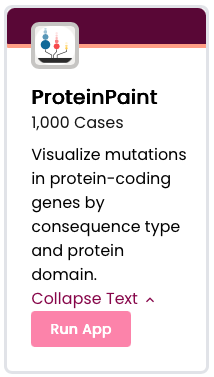
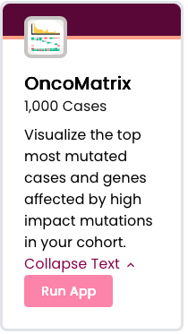
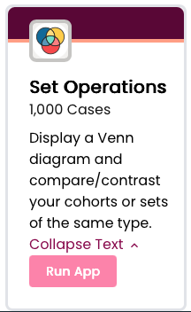

# Coming Soon!

### Protein Paint

Visualize mutations in protein-coding genes by consequence type and protein domain.

<figure markdown="1">

{ style="width:100%; height:400px; object-fit:contain; border-radius:8px;" }

</figure>

### Oncomatrix

Visualize the top most mutated cases and genes affected by high impact mutations in your cohort.

<figure markdown="1">

{ style="width:100%; height:400px; object-fit:contain; border-radius:8px;" }

</figure>

### Set Operations

Display a Venn diagram and compare or contrast your cohorts or sets of the same type.

<figure markdown="1">

{ style="width:100%; height:400px; object-fit:contain; border-radius:8px;" }

</figure>

