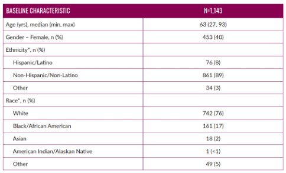
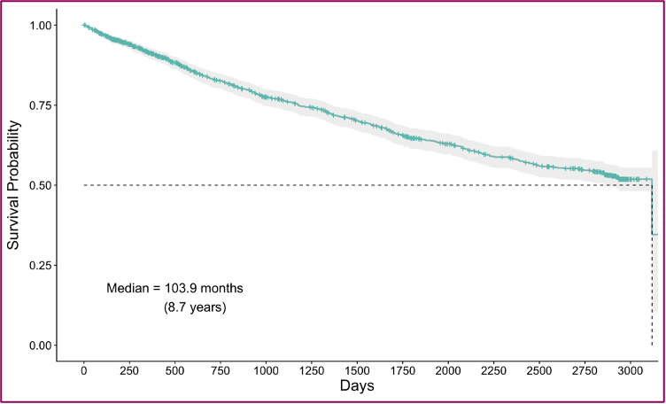

# About the MMRF CoMMpass Study

## Background & Purpose

The **MMRF CoMMpass Study** is a landmark, longitudinal, multi-center research effort designed to comprehensively map the genomic and clinical landscape of **multiple myeloma (MM)**. Launched in 2011, CoMMpass represents one of the most ambitious precision medicine initiatives in cancer and has generated the largest integrated genomic and clinical dataset ever assembled for a single cancer type.

---

## Study Overview (At a Glance)

- **Study Design:** Prospective, longitudinal, observational study  
- **Sponsor:** *The Multiple Myeloma Research Foundation (MMRF)*  
- **Collaborators:** Translational Genomics Research Institute (TGen), the Myeloma Research Consortium (MMRC), and numerous academic and industry partners  
- **Enrollment:** More than **1,100 patients** newly diagnosed with multiple myeloma  
- **Clinical Sites:** 90+ sites across North America and Europe  
- **Follow-up:** Up to **8 years** of longitudinal clinical and molecular data per patient  

The study was intentionally designed to reflect **real-world medical practice**, enabling insights that translate directly to patient care and clinical trial design.

<figure markdown="1">

{ width="100%" }

<figcaption style="text-align: center; font-size: 0.9em;">
Overview of the MMRF CoMMpass Study design and data generation
</figcaption>

</figure>

<figure markdown="1">

{ width="100%" }

<figcaption style="text-align: center; font-size: 0.9em;">
Overall survival outcomes observed in the CoMMpass cohort
</figcaption>

</figure>

{ max-width="100%", height="auto" }

---

## Study Design & Timeline

CoMMpass follows patients prospectively from diagnosis through multiple lines of therapy, with structured clinical assessments and repeated biospecimen collection over time.

**Key milestones include:**

- **2011:** Study initiation and first patient enrollment  
- **2012–2016:** Progressive data generation and early interim analyses (IA02–IA10)  
- **2017–2020:** Expansion of genomic assays, deeper longitudinal follow-up, and public data releases  
- **2025:** Final data harmonization and release (IA24) into the MMRF Virtual Lab  

This design enables detailed study of disease evolution, treatment response, resistance mechanisms, and long-term outcomes.

---

## Data Collected

Across the study, CoMMpass captured a broad range of harmonized clinical and molecular data, including:

- **Demographic data** (e.g., age, race, sex)
- **Disease characteristics** at diagnosis
- **Laboratory and biomarker values**
- **Treatment details**, including:

    - Induction regimens  
    - Transplant status  
    - Maintenance therapy  
    - Subsequent lines of treatment

- **Longitudinal clinical outcomes**

    - Response assessments  
    - Progression-free survival (PFS)  
    - Overall survival (OS)
    
- **Imaging and bone disease assessments**
- **Pathology and cytogenetic results** (when available)
- **Patient-reported outcomes**, including quality-of-life instruments

Importantly, the study reflects a **real-world patient population**, with **17% Black/African American participants**, consistent with the demographic distribution of myeloma incidence in the United States.

---

## Biospecimen Collection

Participants contributed biospecimens at diagnosis and at structured follow-up visits, including:

- **Bone marrow aspirates**
- **Peripheral blood samples**

These specimens were used to generate multiple molecular data types, including:

- Whole genome sequencing (WGS)  
- Whole exome sequencing (WES)  
- Bulk RNA sequencing (RNA-Seq)  
- Single-cell RNA sequencing (subset of samples)  
- Immune profiling (including CyTOF and circulating tumor cell enumeration)

The paired clinical and molecular nature of the dataset enables deep exploration of clonal evolution, immune dynamics, and genotype–phenotype relationships.

---

## Interim Analysis (IA) Releases

CoMMpass data were released incrementally through **24 Interim Analyses (IA01–IA24)**. Each IA represents a defined “data cut” incorporating:

- Newly enrolled patients  
- Updated clinical follow-up  
- Newly sequenced biospecimens  
- Pipeline improvements and quality control refinements  

**IA24** represents the **final and most comprehensive release**, containing fully harmonized clinical and genomic datasets for all study participants.

---

## Access in the MMRF Virtual Lab

The **MMRF Virtual Lab** provides controlled access to CoMMpass data through an integrated analysis and data-sharing environment.

Users can:

- Build cohorts using harmonized clinical variables  
- Explore clinical distributions and survival outcomes  
- Compare patient subgroups  
- Download project-level summary files for historic IA releases  
- Access comprehensive clinical and genomic files for IA24  

Additional details are available in the *Interim Analysis Data Access* and *Clinical Data Dictionary* sections.

---

© The Multiple Myeloma Research Foundation. All rights reserved.
