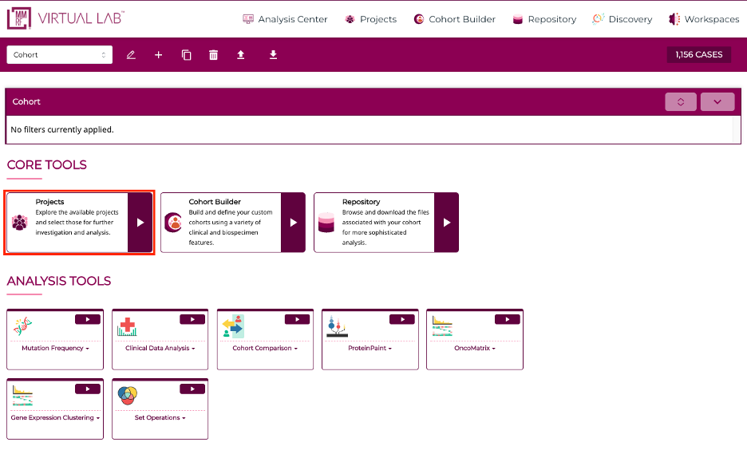
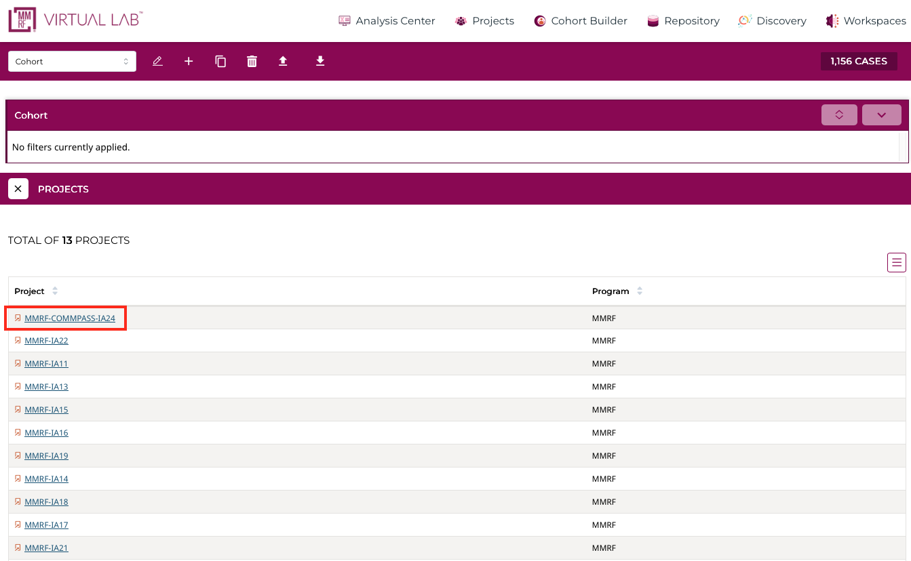
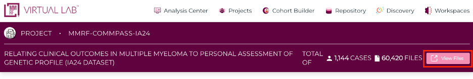
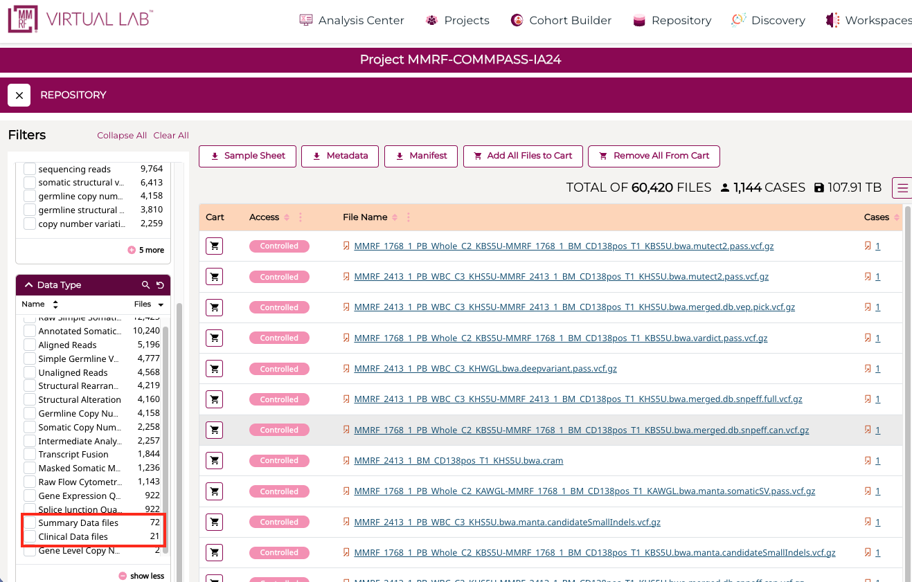

# CoMMpass Interim Analysis  

The **CoMMpass study** was designed to collect and release genomic and clinical data in an iterative fashion over the course of the project. This structure ensured that researchers, pharmaceutical partners, and internal MMRF teams had access to high quality data in a timely and reproducible manner. Each **Interim Analysis (IA)** served as a defined “data cut”, incorporating new patients, new follow-up visits, or refinements to analytical pipelines and quality control standards.

Across the lifespan of CoMMpass, 24 interim analyses were planned, culminating in IA24, the final comprehensive release of harmonized clinical and genomic data for all study participants. 

## Data Release Framework
Each Interim Analysis release contained multiple data layers:

| Data Layer | Description | Example Outputs
|-------|--------------| --------------|
| Clinical Data | Updated patient-level variables (diagnosis, treatments, outcomes) | Clinical.tsv, therapy tables |
| Genomic Data | WGS/WES VCFs, RNA-seq expression, CNV, SV, and annotation files | .vcf.gz, .maf, .counts.txt |
| Metadata | Sample identifiers, assay QC metrics, version tracking | Sample manifests, readme logs |
| Documentation | README, change logs, pipeline versions | IA11_README.txt, JetStream logs |

## Accessing CoMMpass IA Releases

All CoMMpass Interim Analysis releases are available through the **Projects Page** in Virtual Lab.

### Step 1: Navigate to Projects

- From the Virtual Lab homepage, click **Projects** under *Core Tools*  
- This opens the full list of available datasets

### Step 2: Select an IA Release

- Locate the desired project (e.g., **MMRF-IA11**, **MMRF-IA22**, **MMRF-IA24**)  
- Click the **Project ID link** to open the project details page  

### Step 3: Open the Repository

- On the project page, click **View Files** (top right)  
- This opens the **Repository**, where all files for that IA release are stored  

### Step 4: Download Files

Files can be downloaded in two ways:

**Option A: Individual Download**

- Click a file name to download directly

**Option B: Cart-Based Download (Recommended)**

- Add files to your cart using the cart icon  
- Or select **Add All Files to Cart**  
- Proceed to download via the cart interface  

### Accessing IA24 (Final Release)
**IA24 differs from historic releases** in that it includes the full set of clinical and molecular data generated across the study. As a result, the Repository contains **tens of thousands of files**, including raw and processed genomic data.

### Step 1: Open IA24 Repository

- Navigate to **Projects → MMRF-COMMPASS-IA24**
- Click **View Files**

### Step 2: Apply Filters to Identify Key Files

To locate commonly used datasets such as summary outputs and clinical tables:

- In the left-hand filter panel:

  - Expand **Data Category**
  - Select:
    - **Summary Data Files**
    - **Clinical Data Tables**

Applying these filters will reduce the file list substantially (e.g., from ~60,000 files to a focused set of relevant datasets).

### Step 3: Review Filtered Results

Filtered results may include:

- Summary-level datasets (e.g., mutation summaries, expression summaries)
- Harmonized clinical data tables (e.g., labs, treatments, outcomes)

### Step 4: Download Files

Files can be downloaded in two ways:

**Option A: Individual Download**

- Click a file name to download directly

**Option B: Cart-Based Download (Recommended)**

- Add files to your cart using the cart icon  
- Or select **Add All Files to Cart**  
- Proceed to download via the cart interface  

For additional details, see the [Repository & Data Download](../user-guide/repository.md) documentation.

*© The Multiple Myeloma Research Foundation. All rights reserved.*
