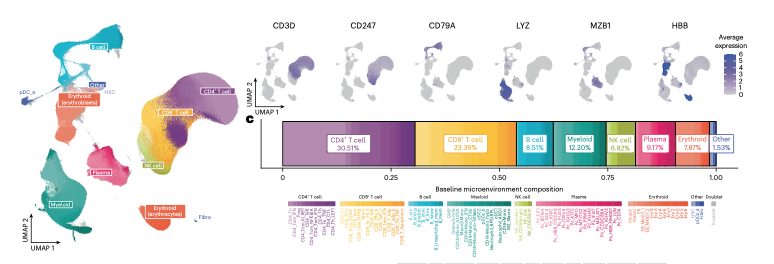

# Immune Atlas

## Overview

The **MMRF Immune Atlas** is a collaborative, multi-institution effort designed to characterize the immune microenvironment of multiple myeloma at single-cell resolution and to integrate immune profiling with the genomic and clinical data generated through the **MMRF CoMMpass Study**.

Launched in 2019, the Immune Atlas extends CoMMpass beyond tumor-centric analyses by enabling systematic study of immune cell composition, functional states, and longitudinal immune dynamics in the bone marrow and peripheral blood.

---

## Immune Atlas Consortium

The Immune Atlas was developed through a coordinated network of five academic medical centers with deep expertise in myeloma research and immune profiling:

- Emory University  
- Beth Israel Deaconess Medical Center  
- Washington University in St. Louis  
- Icahn School of Medicine at Mount Sinai  
- Mayo Clinic  

All participating sites adopted **harmonized sample processing protocols, assay strategies, and analysis pipelines**, ensuring comparability of immune data across institutions and timepoints.

---

## Data Generated

Immune Atlas data was generated from biospecimens collected from participants enrolled in the **MMRF CoMMpass Study**.

### Assays

- Single-cell RNA sequencing (scRNA-seq)
- Cytometry by Time of Flight (CyTOF)

### Sample Types

- Bone marrow aspirates  
- Peripheral blood  

### Sampling Strategy

- Baseline (newly diagnosed)
- Longitudinal follow-up (post treatment, post transplant, response, relapse)

### Scale

- 1,100 immune-profiled samples
- ~700 CoMMpass participants
- More than 1.1 million individual immune cells profiled

---

## Data Integration with CoMMpass

Immune Atlas data is linked at the patient and sample level to CoMMpass clinical and genomic data, enabling integrated analyses across:

- Tumor genomics (WGS, WES)
- Tumor gene expression (bulk RNA-seq)
- Clinical outcomes (response, PFS, OS)
- Treatment exposures
- Immune cell composition and transcriptional states

This integrated design allows investigators to examine relationships between immune features, tumor biology, and clinical outcomes.

---

## Large-Scale Single Cell Characterization of Meyloma Bone Marrow

Access to the **MMRF Immune Atlas** enables a deep and systematic understanding of the bone marrow microenvironment in multiple myeloma. Through a coordinated, multi-institutional effort, the MMRF-led consortium has generated and harmonized single-cell immune profiles at an unprecedented scale and resolution. The Immune Atlas team has already determined, and will make available through the MMRF Virtual Lab, the identification and rationale for labeling major and minor immune and hematopoietic cell populations across the myeloma bone marrow microenvironment.

### Immune Landscape of Newly Diagnosed Multiple Myeloma (Pilcher *et al.*)

The recent Immune Atlas study by **Pilcher *et al.*** describes comprehensive immune profiling of **1,397,272 single cells** derived from the bone marrow of **337 newly diagnosed CoMMpass participants**. Using integrated single-cell RNA sequencing and complementary immune assays, the study systematically characterized immune and hematopoietic cell populations and linked immune states to cytogenetic risk, disease progression, and clinical outcome.

Key findings include:

- **Cytogenetic risk-associated immune differences**, with 17p13 deletion showing distinct enrichment of a **type I interferon signaling signature** within the bone marrow T-cell compartment.
- **Disease progression-associated immune states**, including a **pro-inflammatory immune senescence–associated secretory phenotype** observed in patients with rapid progression.
- **Evidence of active intercellular signaling**, including interactions involving **APRIL (a proliferation-inducing ligand)** and **BCMA**, suggesting immune–tumor communication pathways that may promote tumor growth and survival.

The figures below provide a high-level view of the immune, hematopoietic, and tumor cell landscape captured in the Immune Atlas dataset. Together, they illustrate the diversity, relative abundance, and hierarchical structure of cell populations represented across more than 1.37 million single cells. Details on annotation and labeling the major and minor cell types are available.

{ max-width="100%", height="auto" }

---

## Key Analytic Use Cases

Immune Atlas data have supported analyses including:

- Identification of immune states associated with **disease risk and progression**
- Characterization of **immune recovery and remodeling** following therapy
- Comparison of immune profiles in patients with **rapid versus durable responses**
- Longitudinal tracking of immune changes from diagnosis through relapse
- Integration of immune features with genomic risk models

These analyses form the basis of multiple high-impact publications and ongoing translational research efforts.

---

## Availability in the MMRF Virtual Lab

Immune Atlas data derived from CoMMpass participants are available through the **MMRF Virtual Lab**, alongside harmonized clinical and genomic datasets.

Available resources include:

- Single-cell expression matrices
- Immune cell annotations and metadata
- Sample and patient level linkage to CoMMpass clinical variables
- Longitudinal immune profiling across disease course

<!--This data can be accessed for exploratory analysis, cohort-based comparisons, and downstream computational workflows, subject to applicable data access controls.-->

---

## Publications and Ongoing Analyses

Immune Atlas data have been used in multiple peer-reviewed publications, including landmark studies in *Nature Cancer* and *Blood Cancer Discovery*, with additional analyses ongoing.

A summary of key Immune Atlas publications is provided in the [Impact & Major Publications](major-publications.md) section.

---

*© The Multiple Myeloma Research Foundation. All rights reserved.*
