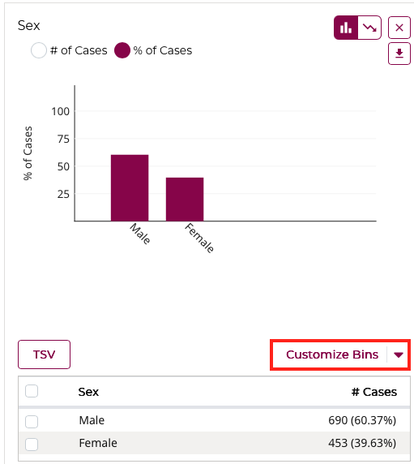
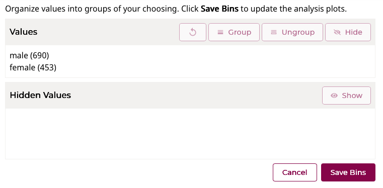

# Clinical Data Analysis

## Overview

The **Clinical Data Analysis** tool in the MMRF Virtual Lab allows researchers to generate interactive visualizations of key clinical attributes within a selected cohort. Users can explore demographic and diagnostic variables, create custom groupings, and visualize the data across multiple chart types.

These visualizations help researchers quickly identify trends and relationships in the clinical data, such as distributions by sex, race, or survival outcomes.

---

## Accessing the Clinical Data Analysis Tool

To access this feature:

1. Navigate to the **Analysis Center** from the main navigation bar.  
2. Select or create a cohort to analyze.  
3. Under **Analysis Tools**, click the **Clinical Data Analysis** card.  

The page will display all available clinical attributes for your cohort along with interactive visualization options.

---

## Key Features

The Clinical Data Analysis tool enables users to:

- Select which clinical fields to display in the workspace.  
- View data distributions through **histograms**, **box plots**, and **survival plots**.  
- Create **custom bins** to re-group values for categorical or continuous variables.  
- Select subsets of data directly from a visualization to create new cohorts or modify existing ones.  
- Download visualizations as **SVG** or **PNG** images.  
- Export underlying data in **JSON** or **TSV** format.  
- Print all clinical variable cards and their active plots to a single **PDF**.

---

## Enabling Clinical Variable Cards

Use the control panel on the left to choose which clinical variables to visualize. Click the toggle switches next to each variable to enable or disable its display. Each enabled variable appears as a **card** in the workspace with selectable plot types.

Clinical fields are grouped into the following categories:

- **Demographic:** Patient characterization data (e.g., age, sex, race, ethnicity).  
- **Diagnosis:** Information on disease type, stage, and related diagnostic metrics.  

---

## Exploring Clinical Variable Visualizations

Each clinical variable card supports one or more visualization types. Use the icons in the upper-right corner of the card to switch between plot types.

### Histogram

Displays the distribution of cases across a selected clinical field as a bar chart. This plot supports both **categorical** and **continuous** variables.

Features:

- View frequency and percentage of cases in each category.  
- View the data in tabular format.  
- Select specific bars to define new cohorts or modify existing ones.  
- Download plots in **SVG** or **PNG**.  
- Export data in **JSON** or **TSV** formats.

---

### Survival Plot

Displays survival outcomes over time for one or more patient categories (e.g., gender or treatment type). The MMRF Virtual Lab uses the **Kaplan–Meier estimator** to calculate survival probability over time.

Required fields:

- **Days to death** or **days to last follow-up**  
- **Vital status (alive/deceased)**  
- **Category field** to separate cases (e.g., gender or treatment group)

Features:

- Select up to 5 categories to include in the plot.  
- View counts and survival percentages in the accompanying data table.  
- Download survival curves in **SVG** or **PNG**.  
- Export underlying data as **JSON** or **TSV**.

---

## Creating Custom Bins

Custom bins allow researchers to redefine how data are grouped within visualizations. You can apply this to both **categorical** and **continuous** variables.

Click **Customize Bins** → **Edit Bins** to open the configuration window.

### Categorical Binning

- Combine existing values into new, broader groups.  
- Rename or hide categories.  
- Ungroup or restore previously hidden values.  

---

### Continuous Binning

Two binning methods are supported:

**1. Equidistant Bins**  

   - Define interval sizes (e.g., 10 years, 1,000 days).  
   - Optionally set start and end values.  

**2. Custom Range Bins**  

   - Manually create bins with user-defined ranges.  
   - Name each range and specify min/max values.

You can reset any custom binning to default values at any time by selecting **Reset to Default**.

---

## Exporting and Downloading

Each clinical card supports the following export options:

- **Download Visualization:** Save as `.svg` or `.png` images for use in reports or presentations.  
- **Download Data:** Export the data table in `.json` or `.tsv` format.  
- **Print to PDF:** Generate a combined PDF containing all active clinical cards and plots.

---

*© The Multiple Myeloma Research Foundation. All rights reserved.*