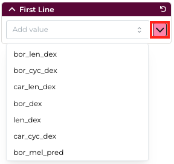
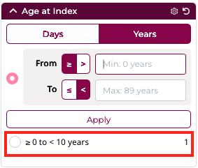
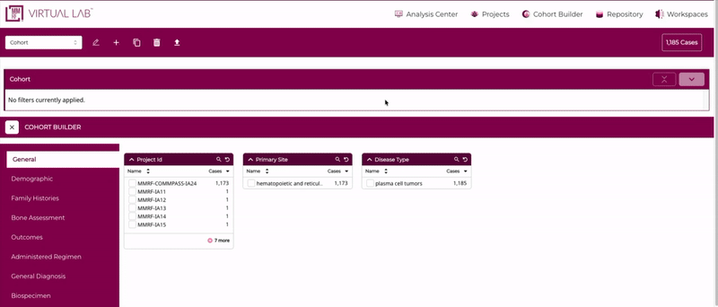

# Cohort Builder

The **Cohort Builder** allows users to define a set of cases based on clinical and molecular criteria, and use that same cohort across Virtual Lab (Repository, visualizations, <!--downloads,--> and analyses). It is the fastest way to focus your work on exactly the patient population you are interested in. This section will cover hte process of building a cohort and downstream actions will be documented in their respective sections.

**Tip:** Filters within the Cohort Builder are applied to the cases in your cohort. If you wish to target specific types of files for download, use the filters within the Repository.

The Cohort Builder can be accessed via:

- Selecting the Cohort Builder link in the MMRF Virtual Lab header

  

OR

-  Selecting the 'Run App' button on the Cohort Builder card in the Analysis Center

  
---

## Cohort Builder Panel Layout

The **Cohort Builder** appears as a panel within the **Analysis Center** and is used to refine the active cohort to a specific set of cases.

Your **current cohort** is always visible in the top navigation bar and can be updated directly from that toolbar at any time.

On the left side of the panel, you'll find a set of **broad filter categories** that can be expanded.

Each category contains a collection of **cohort builder cards**, which provide the individual filters used to narrow your case set based on clinical, molecular, or biospecimen criteria.

### Cohort Builder Cards

Each **Cohort Builder** card represents a specific variable or attribute that can be used to filter cases. 
Cards are grouped within broader categories such as *Subject*, *Demographic*, *Diagnosis*, or *Outcomes*.

Each **Cohort Builder card** includes tools in the top-right corner of the header that make filtering faster and more interactive:

- **Search** - click the magnifying-glass icon to show or hide a text field for searching within the card's available values.
<!--- **Flip Card** - select the flip icon to reveal or hide a summary chart. This view provides a quick visualization of the data distribution for that variable, helping you understand trends before applying filters. -->
- **Reset Card** - click the reset icon to clear any filters currently applied within that card and restore all default values.

Filters in each card can be sorted, either alphabetically or by the number of cases based on current filters, by selecting one of the two headers directly underneath the card title. The default sort is alphabetical order.

By default, each **Cohort Builder card** displays up to six filter values. Click the "+" button to expand the list and view up to 20 values at once. The button also shows how many additional options are available. To collapse the list back to its original view, select **"Show less"**.

As you make selections within a card, the number of cases that meet your criteria is updated in real time at the top of the panel. This allows you to iteratively refine your cohort and immediately see the impact of each filter applied. 

Some **Cohort Builder cards** include hundreds of possible values - for example **Regimen Name, Regimen Short Name** or other treatment variables. These filters use a **search-enabled multi-select interface** rather than a long checkbox list.

This design allows users to quickly identify the values they want without scrolling.

Features include:

<figure markdown>
  
  <figcaption>
    A searchable text entry box.
  </figcaption>
</figure>

<figure markdown>
  
  <figcaption>
    A dropdown showing the top ~5 most frequent values by default, dynamically updating as you type.
  </figcaption>
</figure>

<figure markdown>
  
  <figcaption>
    The ability to select multiple values, each appearing as a removable tag.
  </figcaption>
</figure>

<figure markdown>
  
  <figcaption>
    Automatic updates to the Cohort Bar and case count as selections are made.
  </figcaption>
</figure>

<!--A searchable text entry box 
A dropdown that displays the top ~5 most frequent values (default) and all matching results as you type 
The ability to select multiple values, each appearing as a removable tag 
Automatic updates to the Cohort Bar and case count -->

This interface is ideal for filtering by treatment patterns or selecting specific therapeutic combinations.

Some clinical variables - such as **Age at Index, Days to Death**, or **Days to Last Follow-Up** - are numeric and use a range-based interface instead of a list of categorical values.

These cards include:
<figure markdown>
  
  <figcaption>
    <strong>Unit toggle</strong> between <em>Days</em> and <em>Years</em>.
  </figcaption>
</figure>

<figure markdown>
  
  <figcaption>
    <strong>From / To</strong> numeric input fields for defining ranges.
  </figcaption>
</figure>

<figure markdown>
  
  <figcaption>
    Built-in constraints displaying the minimum and maximum valid values.
  </figcaption>
</figure>

<figure markdown>
  
  <figcaption>
    An <strong>Apply</strong> button to confirm selections and update the cohort.
  </figcaption>
</figure>

<figure markdown>
  
  <figcaption>
    Automatically generated labeled bins shown beneath the card after applying filters.
  </figcaption>
</figure>
<!--**Unit toggle** between *Days* and *Years* 
**From / To** numeric inputs 
Built-in constraints showing min/max valid values 
Ability to specify ≥ or ≤ using toggle buttons 
An **Apply** button to confirm and update the cohort 
Automatically created labeled bins below the card after filters are applied -->

<!--### Custom Filters
If you can't find a specific filter within the standard categories, use the **"Custom Filters"** section to access any additional variables not displayed by default. 

You can browse through the full list of available filters or use the search bar to quickly locate a filter by name. Once selected, the filter will appear as a new **Custom Filter card** within this section, where it can be used like any other card.

To remove a custom filter, click the **"X"** in the upper-right corner of the card. 

You can also simplify the list by enabling **"Only show properties with values"** option, which hides filters that currently have no associated data in the MMRF Virtual Lab.

-->

## Cohort Bar
The **Cohort Bar** appears at the top of the **Cohort Builder** panel and display the filters that define your active cohort. 

As you select variables such as project, demographics, or clinical attributes, each filter appears in the Cohort Bar as a tag showing the property as its selected value(s).

Each tag can be removed individually by clicking the **"X"** icon, or you can reset all filters using the **"Clear All"** link.

The Cohort Bar automatically updates in real time as new filters are applied, ensuring that the active cohort always reflects your current selections. 

The Cohort Bar provides a simple, visual summary of your applied filters and acts as the control center for your cohort definition. As the MMRF releases data periodicallly rather than continuously, cohort definitions will remain consistent over time unless new datasets are introduced to Virtual Lab. 

## Closing the Cohort Builder
Once you've finishd applying filters and defining your custom cohort, you can close the **Cohort Builder** and continue working with that cohort across other tools within the **Analysis Center**.

To close the Cohort Builder panel and reutrn to the full Analysis Center view, click the **"X"** button in the upper-left corner of the Cohort Builder header.

Alternatively, you can navigate to the **Analysis Center** or select any other tool from the Virtual Lab header menu.

Your current cohort will remain active as you move between tools - ensuring your selected participant persist throughout your session.

Once the Cohort Builder is closed, you can:
- **Download** data files associated with the cohort from the **Repository**
- **Visualize and analyze** the cohort busing tools within the **Analysis Center**
