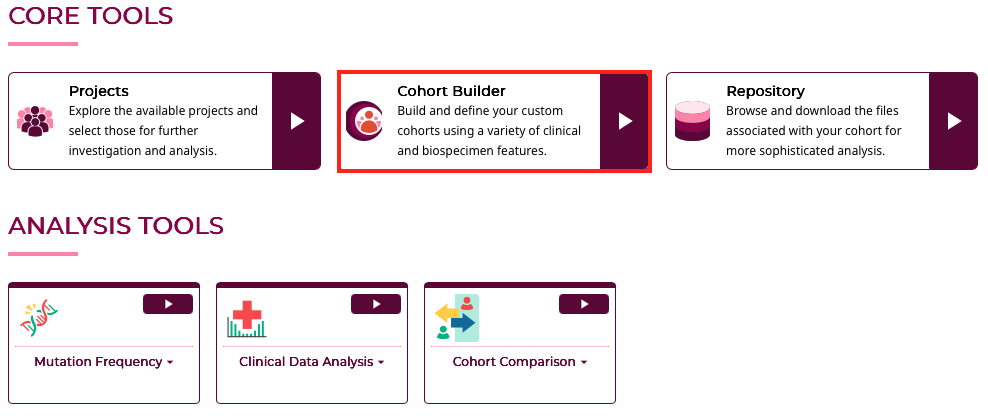
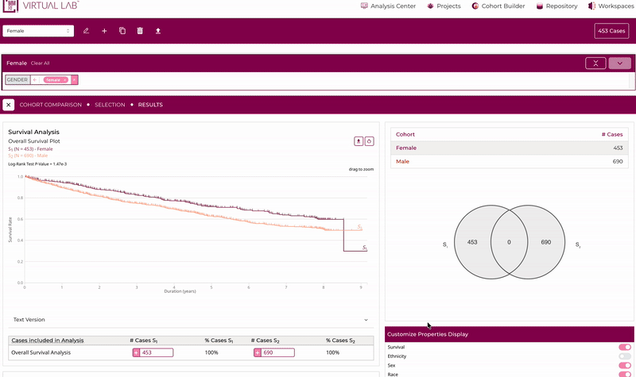
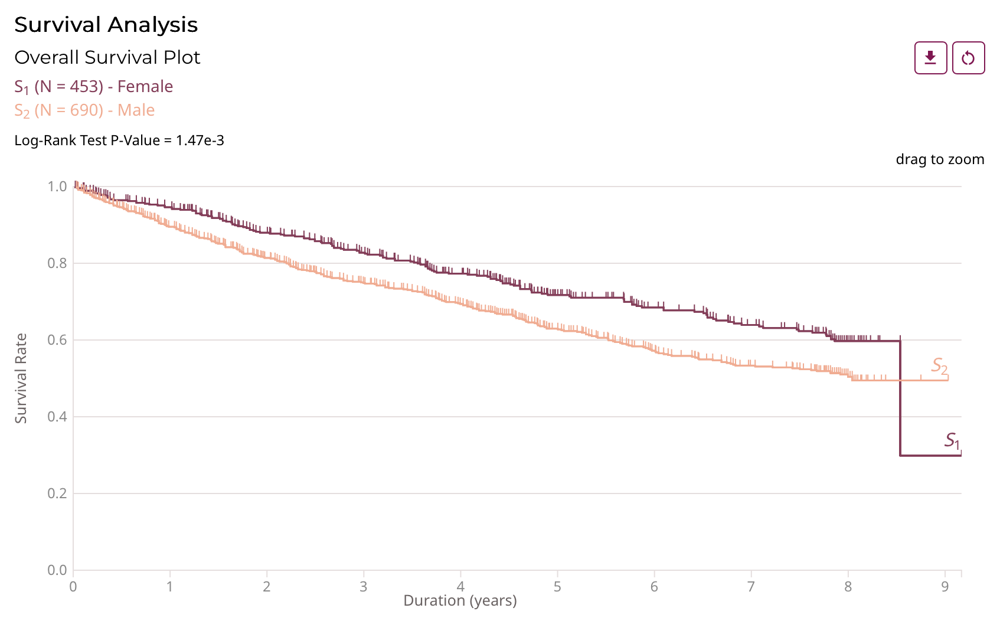
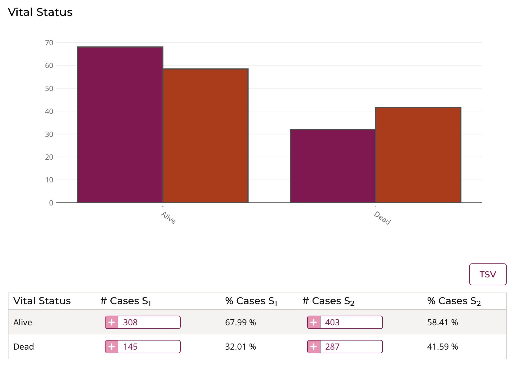
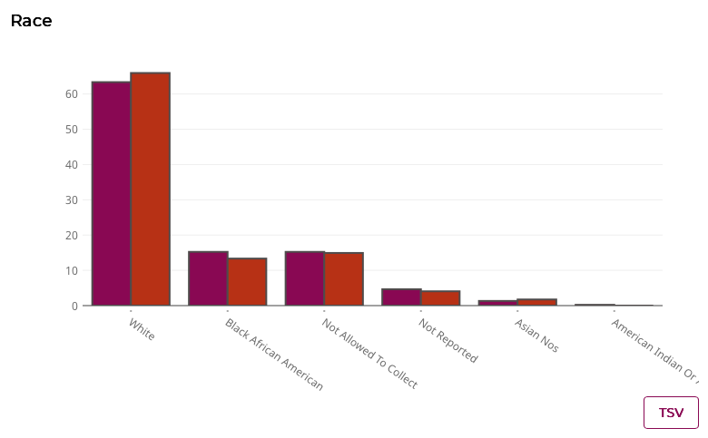
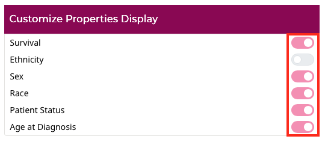

# Cohort Comparison

## Overview

The **Cohort Comparison** tool allows researchers to compare two saved cohorts within the MMRF Virtual Lab. This feature displays side-by-side visual and tabular summaries that highlight similarities and differences between cohorts based on clinical and demographic variables.

Before accessing this tool, users must first have at least **two saved cohorts**. You can create and save cohorts using the **Cohort Builder** in the Analysis Center.

---

## Accessing the Cohort Comparison Tool

To access the Cohort Comparison:

1. Navigate to the **Cohort Comparison** tool from the Core Tools menu.  
2. Select a **primary cohort** to compare from the drop-down list.  
3. Click the **Cohort Comparison** tab or icon.  
4. Choose a **second cohort** from your list of saved cohorts.  
5. Click **Run** to generate comparison visualizations.

The top of the page displays your selected cohorts and the **total number of cases** included in each.

---

<!--## Cohort Summary Panel

Once two cohorts are selected, the **Cohort Summary Panel** displays key metrics for each:

- **Cohort name** and **number of cases** in each dataset.  
- **Venn diagram** illustrating the overlap between cohorts (*shared and unique cases*).  
- **Color-coded keys** to represent each cohort consistently across all visualizations.

 -->

---

## Results Panel

After generating a comparison, the **Results** section presents multiple visualizations and data tables.  
Each chart and table enables researchers to examine proportional distributions across common clinical attributes.

The following features are currently available:

### 1. Survival Analysis

Displays Kaplan–Meier survival plots comparing the two cohorts. If survival data is unavailable, a notice will appear indicating that no data is currently available for comparison.

---

### 2. Gender

Compares gender distribution between the two cohorts, displayed as a **bar chart** and accompanying table showing counts and percentages. Each bar’s color corresponds to one of the cohorts.

| Gender | # Cases S₁ | % Cases S₁ | # Cases S₂ | % Cases S₂ |
|---------|-------------|-------------|-------------|-------------|
| Male | 604 | 60.7% | 605 | 60.8% |
| Female | 391 | 39.3% | 390 | 39.2% |

---

### 3. Vital Status

Displays the proportion of patients who are **alive** or **deceased** in each cohort. The accompanying table provides absolute counts and percentages for each group.

---

### 4. Age at Diagnosis

Illustrates the age distribution of patients at diagnosis across both cohorts. Results are binned into defined age groups (e.g., *20–30*, *30–40*, *40–50*). Tables below each chart show the count and percentage for each cohort.

<!--  -->

---

### 5. Race and Ethnicity

The Race and Ethnicity facets will allow users to compare the racial and ethnic composition of the two cohorts.  

---

## Customize Display

Users can choose which facets to display in the comparison results.  
Toggle switches allow you to turn on or off specific visualizations such as:

- Survival  
- Ethnicity  
- Sex  
- Race  
- Patient Status
- Age at Diagnosis  

Any changes update the visualizations in real time.

---

## Exporting Results

For each visualization, you can export the corresponding data table by clicking the **TSV** button in the bottom-right corner of the panel. The exported files contain counts and percentages for both cohorts enabling external analysis or integration with statistical software.

---

## Creating a New Cohort from Results

The **Cohort Comparison** tool allows users to define and save new cohorts derived from subsets of the compared groups.  

For example:

- Save only overlapping cases (intersection of both cohorts).  
- Save cohort-specific subsets (unique to one cohort).  

Use the **“+” icons** within each results table to add groups of interest as new saved cohorts for downstream analysis.

---

## Notes

- Cohort comparison currently supports **clinical and demographic variables** only.  
- Charts and tables are dynamically generated based on available cohort metadata.  
- Saved cohorts created from comparison subsets appear automatically in the **Cohort Builder**.

---

*© The Multiple Myeloma Research Foundation. All rights reserved.*
