# Correlation Plot

## Introduction

The **Correlation Plot** is a framework to correlate GDC molecular information (mutation, CNV, gene expression) with patient clinical and survival data.

## Launch Correlation Plot

At Analysis Center, select the "Correlation Plot" card.

[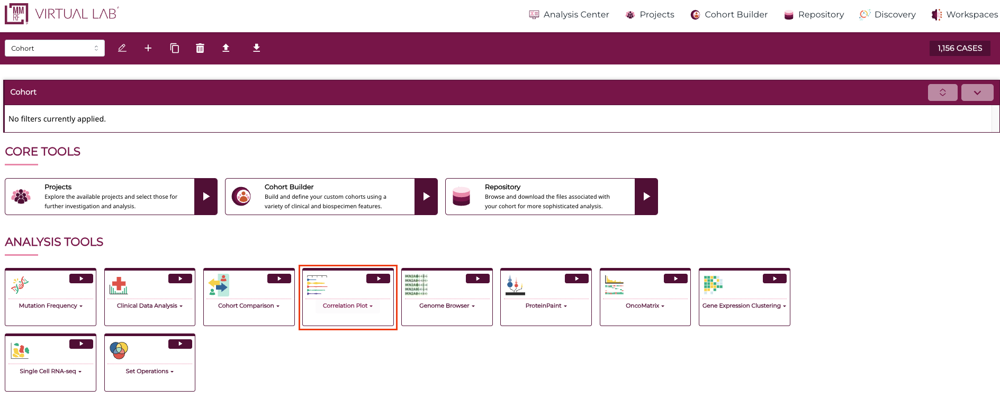](images/correlation/1.png "Click to see the full image.")

This displays an interface for generating correlation plots.

[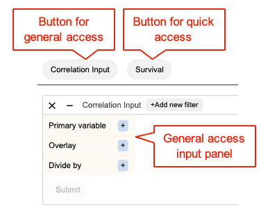](images/correlation/2.png "Click to see the full image.")

## General Access

Clicking the "Correlation Input" button will display the general access panel with three input choices to select data variables and launch the chart.
Only "Primary Variable" is required and the other two choices are optional. 

As a simple example, click the prompt button of Primary Variable to show the variable selection interface. From this interface, select "Gender" variable, which will allow it to populate the Primary Variable, and activate the Submit button. Click the Submit button to launch a barchart showing a breakdown of the selected variable in the current cohort.

[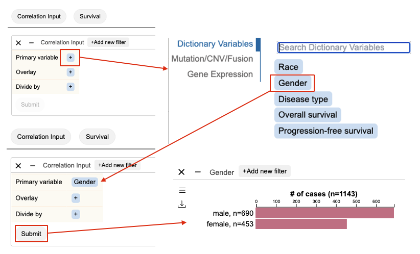](images/correlation/3.png "Click to see the full image.")

The variable selection interface has toggling tabs on the left for choosing between variables of different modalities. This interface is shown for Primary Variable, Overlay, and Divide By. This allows users to select any combination of clinical variables, survival, gene mutation, CNV, and expression into a plot to compare their correlation.

Using the same interface, select two variables to correlate their sample values. As an example, following selection of Gender as Primary Variable, click prompt button for Overlay. At the new panel, click the "Mutation/CNV/Fusion" tab. At the gene search box, search for gene "KRAS". Submit to see a new barchart with KRAS mutation status overlaid on gender types. 

[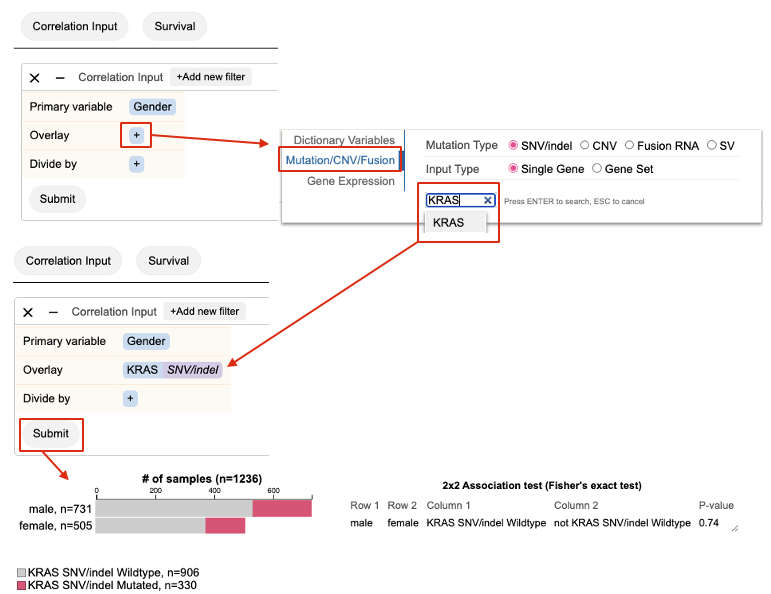](images/correlation/4.png "Click to see the full image.")

## Survival

This quick access button plots the current cohorts overall survival and progression free survival. Choose which survival plot to visualize after selecting "Survival" at the top panel. Each plot shows up as a separate panel.

[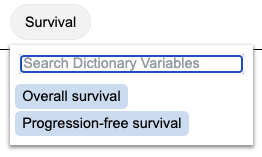](images/correlation/5.png "Click to see the full image.")

[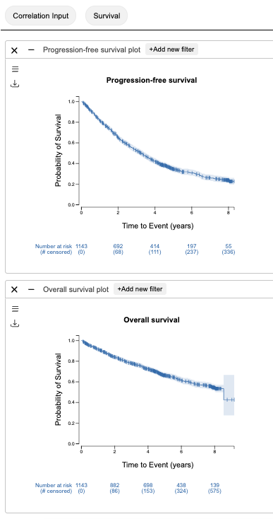](images/correlation/6.png "Click to see the full image.")

### Gene Expression vs. Survival

Link gene expression to survival by searching for gene, KRAS, at the input panel. This will launch a Kaplan-Meier plot comparing survival between three groups of cases, with different TPM expression level, or cases with missing gene expression data.

[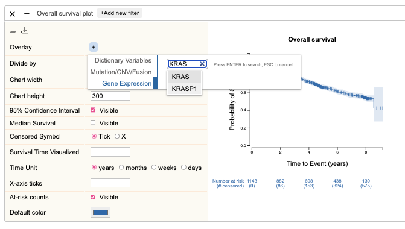](images/correlation/7.png "Click to see the full image.")

[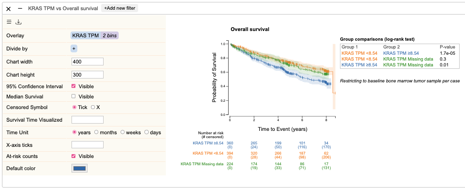](images/correlation/10.png "Click to see the full image.")

A default TPM cutoff is applied to discretize KRAS expression. To customize the cutoff, click the burger menu button at the top left to access options to customize survival plot. Find the "KRAS TPM" tag under the "Overlay" section. Click and select Edit option to open the KRAS expression binning edit menu. At the text box, change the existing cutoff to a new value and press ENTER. As an example, two values 10 and 30 are entered, allowing samples to be divided into 3 bins based on their KRAS expression value: <=10, 10 to 30, \>30.

[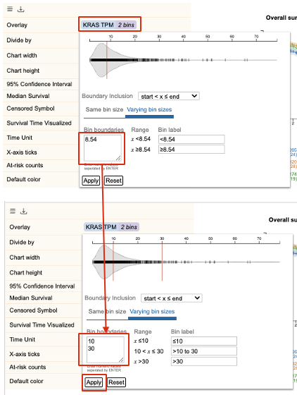](images/correlation/11.png "Click to see the full image.")

[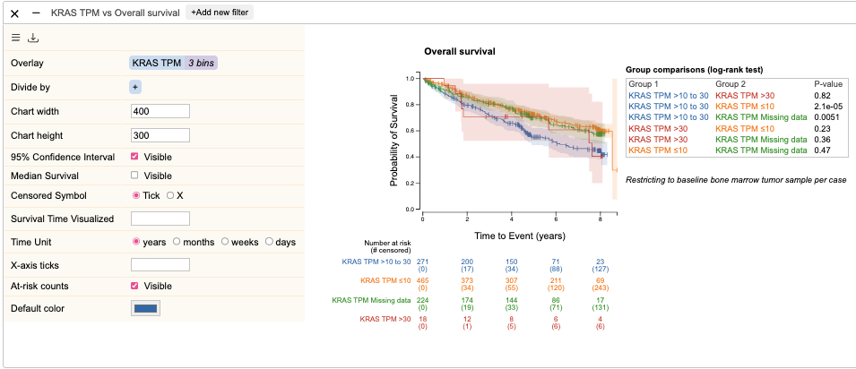](images/correlation/12.png "Click to see the full image.")

### Mutation/CNV/Fusion vs. Survival

Link variation to survival by selecting a mutation to stratify survival with. At the input panel, searching for mutation TP53 will generate a Kaplan-Meier plot comparing survival between TP53 mutated and wildtype groups.

[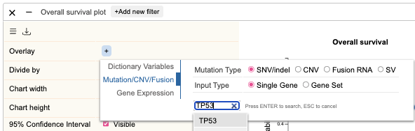](images/correlation/8.png "Click to see the full image.")

[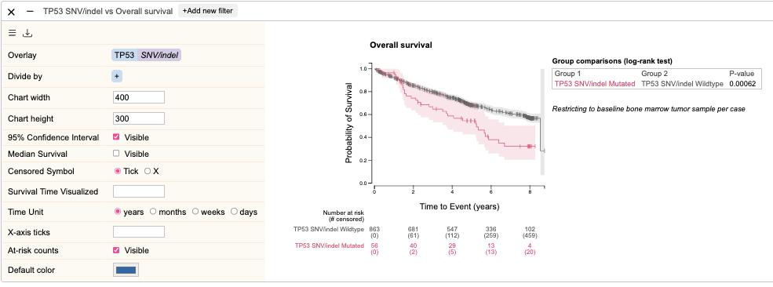](images/correlation/9.png "Click to see the full image.")

