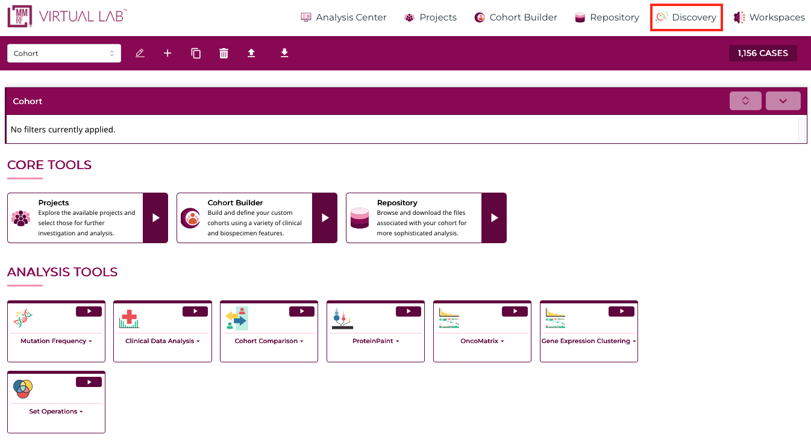
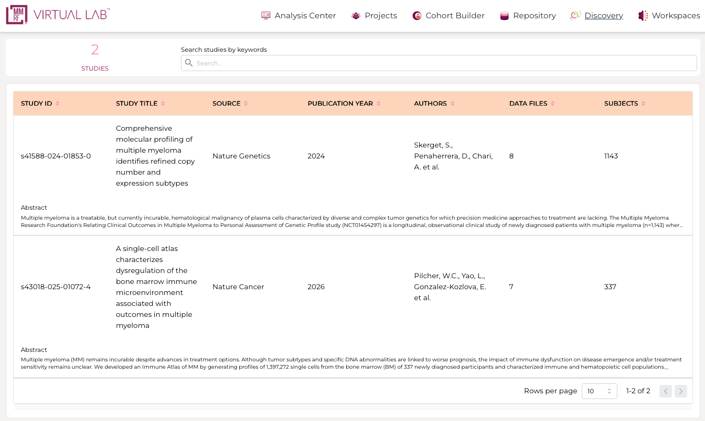

# Discovery

The **Discovery page** in the MMRF Virtual Lab provides a centralized interface for exploring publications and associated datasets derived from CoMMpass and related MMRF studies.

---

## Discovery Page Overview

The Discovery page can be accessed from the top navigation bar via **Discovery**.

This page allows users to:

- Browse available publications  
- Search across studies using keywords  
- View study-level metadata and abstracts  
- Access and download publication-associated datasets (based on permissions)  

---

## Browsing Publications

Upon entering the Discovery page:

- A table of available **studies/publications** is displayed  
- Each row includes:
    - **Study ID**
    - **Study Title**
    - **Source (journal)**
    - **Publication Year**
    - **Authors**
    - **Number of data files**
    - **Number of subjects**

Users can:

- Use the **search bar** to find studies by keyword  
- Scroll through available publications  
- Select a study of interest  

---

## Viewing Study Details

Clicking on a publication opens a **Study Detail View**, which includes:

- Study title  
- Authors and publication metadata  
- Journal and publication year  
- Abstract  
- Associated project/study identifiers  
- Summary-level dataset information  

This view provides context on how the dataset was generated and how it relates to the published findings.

---

## Accessing Publication Data

Within the Study Detail View:

- Scroll down to the **Data Download Links** section  
- A list of files associated with the publication will be displayed  

These may include:

- Supplementary tables  
- Processed analysis outputs  
- Publication-specific datasets  

---

## Downloading Files

Files can be downloaded directly from the Study Detail View:

- Click **Download File** next to the desired dataset  
- Each file corresponds to data supporting the publication  

---

## Access and Permissions

Datasets available through the Discovery page are access-controlled and linked to specific publications.

- Users must request and be granted access to datasets associated with a given manuscript  
- Availability of download options depends on dataset-level permissions  

*© The Multiple Myeloma Research Foundation. All rights reserved.*