# scRNA-seq Analysis

## Introduction

The **Single Cell RNAseq** tool is a framework to analyze single cell RNA sequencing data with cluster plots and gene expression overlays.

## Launch Single Cell RNA-seq Tool

While in the Analysis Center, select the "Single Cell RNA-seq" card.

[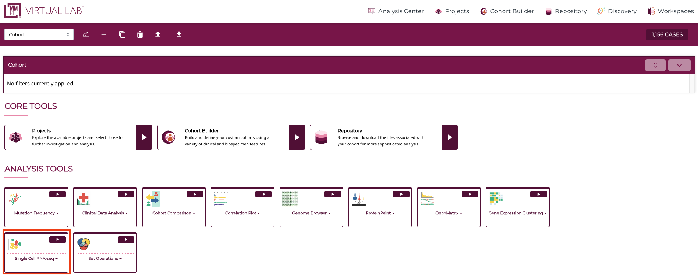](images/scRNA/1.png "Click to see the full image.")

To launch the single-cell RNAseq tool, select “combined” from the data table. A set of blue-colored buttons will be shown.

[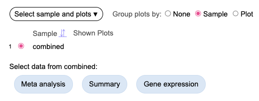](images/scRNA/2.png "Click to see the full image.")

## Meta Analysis (UMAP)

Clicking the "Meta analysis" button will display a UMAP plot for nearly 1.4 million cells. Each dot is one cell, the color of each cell represents the cells lineage group, which is also shown in the legend on the right.

[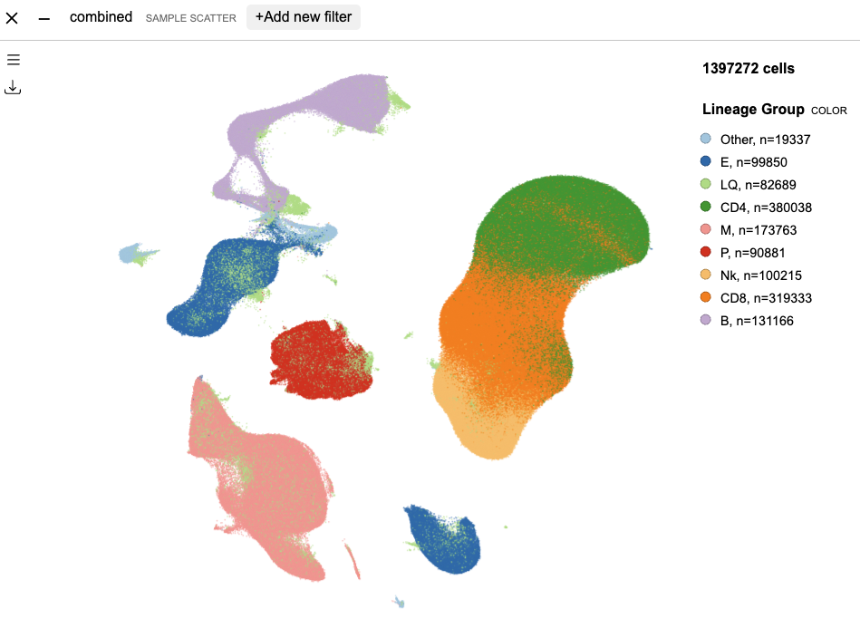](images/scRNA/3.png "Click to see the full image.")

### Isolate Lineage Groups

Using the legend, users can selectively narrow down to cells from specific lineage groups. As example, click the “CD8” entry and select “Show only” option, the UMAP updates to only show CD8 cells. To go back to showing all cells, click on any legend entry and select “Show all”.

[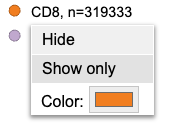](images/scRNA/4.png "Click to see the full image.")

[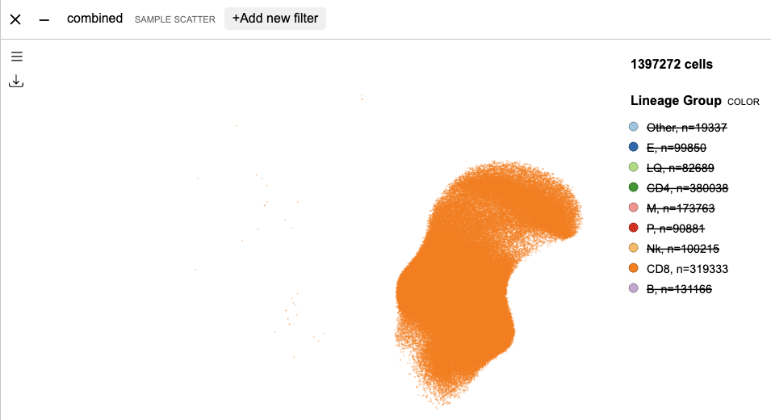](images/scRNA/5.png "Click to see the full image.")

### Single-cell Cell Type Selection

The UMAP overlays with “Lineage Group” by default. Users can switch to a different cell type variable. Click the menu button on top left of the UMAP to show customization options. Click on the “Lineage Group” tag and select “Replace” option.

[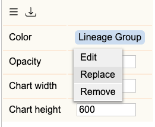](images/scRNA/6.png "Click to see the full image.")

This displays available single-cell cell type variables as below.

[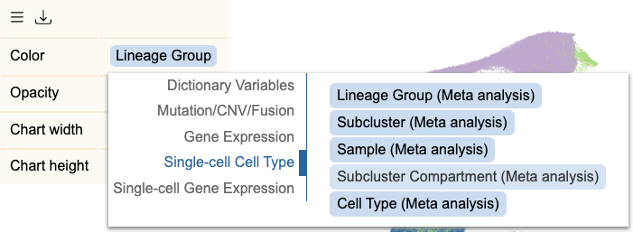](images/scRNA/7.png "Click to see the full image.")

Here selecting “Subcluster Compartment” will update the UMAP as below.

[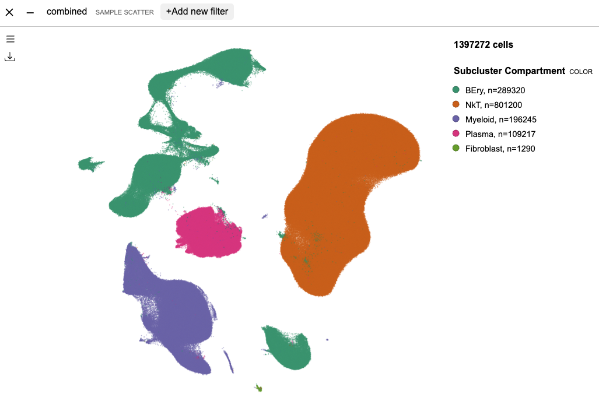](images/scRNA/8.png "Click to see the full image.")
 
### Lineage Group Selection

In the UMAP overlay, multiple cell types can be assigned to a group. For example, in the customization menu, click on “Lineage Group” tag, and select “Edit” function. This displays the following menu where CD8 cell type can be separated out of the rest of cell types via drag and drop. The group names are customizable, as shown with the new group names; “Not CD8” and “CD8”. 

<!-- [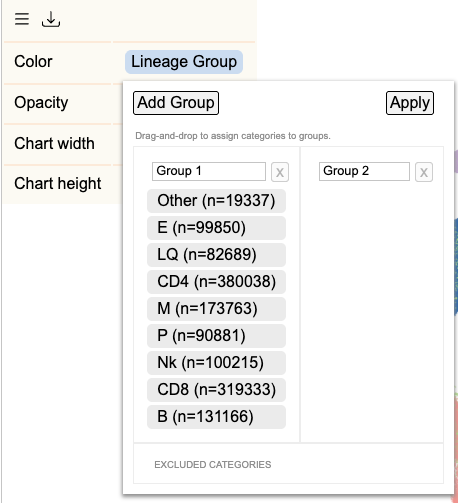](images/scRNA/9.png "Click to see the full image.") -->

[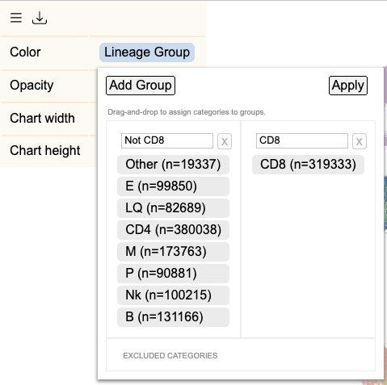](images/scRNA/10.png "Click to see the full image.")

By applying this change, the UMAP changes as shown below.

[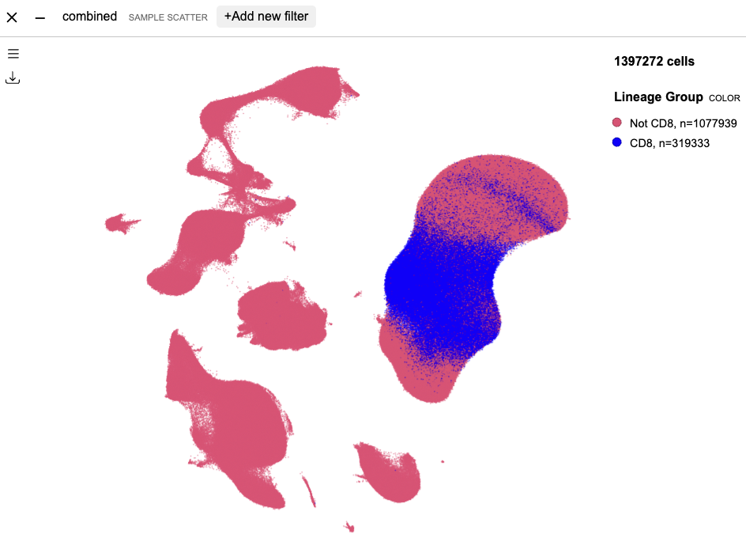](images/scRNA/11.png "Click to see the full image.")
 
### Single-cell Gene Expression

Finally, the user can select a gene to overlay its per-cell expression level on the UMAP. Click on the cell type tag and select “Replace”, then select “Single-cell Gene Expression”. At the search box, type to find any gene in the human genome.

[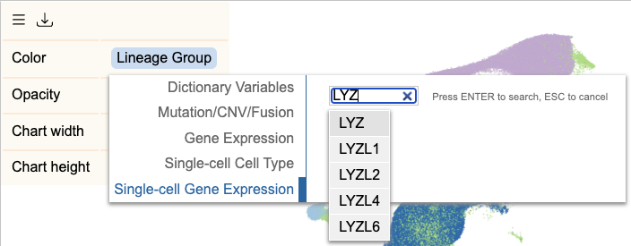](images/scRNA/12.png "Click to see the full image.")

Below, cell-level LYZ gene expression value is overlaid on UMAP.

[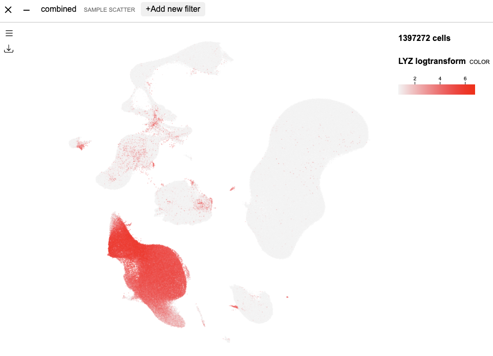](images/scRNA/13.png "Click to see the full image.")
 
## Gene Expression

This next section covers how to summarize cell-level gene expression.

From the data type selector above, select “Gene expression” button. At the new sandbox, type in a gene name to find a gene.

[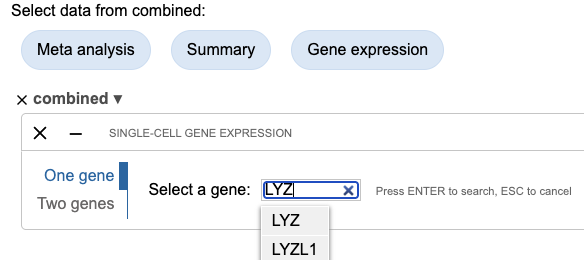](images/scRNA/14.png "Click to see the full image.")

On searching gene LYZ, a violin plot will be shown for distribution of LYZ expression level in all expressed cells.

[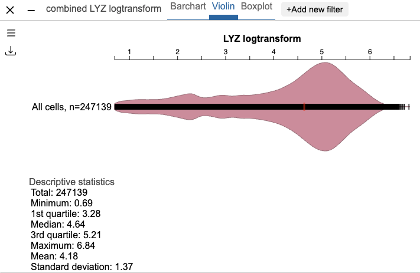](images/scRNA/15.png "Click to see the full image.")

To compare LYZ expression between cell types, click the menu button at top left of violin plot box. At “Overlay”, click the tag to find the variable selection panel. Here, choose “Single-cell Cell Type”, and select “Subcluster Compartment”.

[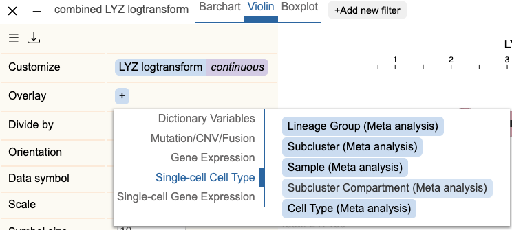](images/scRNA/16.png "Click to see the full image.") 

The violin plot updates to show multiple violins for each compartment, and shows LYZ is highly expressed in myeloid compartment.

[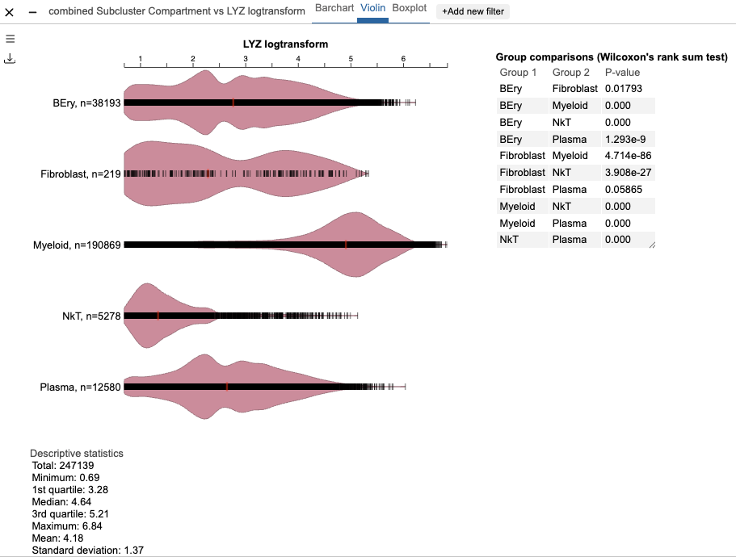](images/scRNA/17.png "Click to see the full image.") 

<!-- Will be added next...
Compare cell type composition between samples
Pseudobulk gene expression analysis -->
